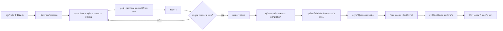

# Use case ตลาดครูดนตรีแบบลงบริการสอนเอง และแรงจูงใจของผู้เข้าร่วม

สำรวจ 25 กันยายน 2026 · ข้อเท็จจริงจากหน้าทางการของธุรกิจระบุแหล่งไว้ในตาราง · ส่วนที่เขียนว่า **ข้อเสนอ MIL** เป็นสมมติฐานผลิตภัณฑ์ที่ยังไม่ผ่านการทดลองกับครูและผู้เรียนไทย

## โจทย์และขอบเขต

ผู้ใช้ต้องการให้ครูดนตรีลง “งานสอน” ได้ในรูปแบบคล้าย marketplace งานบริการ ขณะเดียวกัน Music Industry Lap ตั้งใจให้ผู้เรียนลองบทบาทดนตรีก่อนเลือกเรียน และให้ฟังก์ชันพื้นฐานใช้ฟรีช่วงเริ่มต้น จึงต้องตอบสองคำถามพร้อมกัน: ครูจะยอมลงข้อมูลและรักษาข้อมูลให้สดเพราะอะไร และผู้เรียนจะพบครูที่ตรงเป้าหมายโดยไม่ถูกขัดขวางด้วยตัวเลือกมากเกินไปอย่างไร

**หน่วยสินค้าที่เสนอ:** `บริการสอนหนึ่งแบบ` ไม่ใช่เพียงโปรไฟล์ครู เช่น “ทดลองกีตาร์สำหรับผู้เริ่มต้น 25 นาที”, “ทำเดโมเพลงด้วยมือถือ 4 ครั้ง”, “เตรียมสอบดนตรีไทย 8 ครั้ง” ครูคนเดียวมีหลายบริการได้ แต่ละรายการมีเป้าหมาย ระดับ ราคา เวลา อุปกรณ์ ข้อจำกัด และผลลัพธ์ที่คาดหวังชัดเจน

[ทดลองหน้าลงบริการสอนในต้นแบบ](app-demo/teacher-studio.html): ครูกรอกข้อมูล บันทึกร่าง ดู preview และกดส่งตรวจแบบจำลองได้ ข้อมูลเก็บเฉพาะในเบราว์เซอร์เครื่องนี้ ไม่เผยแพร่หรือส่งให้ผู้เรียนจริง

## สิ่งที่ธุรกิจจริงทำ และสิ่งที่อนุมานได้

| ธุรกิจ/หลักฐานทางการ | กลไกที่ตรวจพบ | คุณค่าฝั่งผู้ให้บริการ | นำมาใช้กับ MIL อย่างไร |
|---|---|---|---|
| [Fastwork สมัครเป็นฟรีแลนซ์](https://fastwork.co/start-selling) | ลงรายละเอียดงานและผลงานก่อนอนุมัติ, เว็บไซต์ระบุทีมตรวจภายใน 48 ชั่วโมง, ช่วยค้นพบงาน, ดูแลเงิน, สร้างเอกสาร, รีวิวหลังงาน | การมองเห็น ความเชื่อมั่นเรื่องรับเงิน และลดงานธุรการ | **ข้อเสนอ MIL:** ตัวสร้างบริการสอนแบบมีโครง, ตรวจข้อมูลก่อนเผยแพร่, ขั้นตอนนัด–สอน–สะท้อนผล; ยังไม่อ้าง SLA 48 ชั่วโมงหรือรับประกันเงิน |
| [Upwork Project Catalog สำหรับผู้ขาย](https://support.upwork.com/hc/en-us/articles/360058234233-How-to-get-started-with-Project-Catalog-as-a-freelancer) และ [วิธีสร้างบริการ](https://support.upwork.com/hc/en-us/articles/360057397533-How-to-create-a-project-in-Project-Catalog) | บริการที่มีขอบเขต ราคา tier ตัวอย่างงาน และสิ่งที่ต้องขอจากลูกค้า; ผู้ขายเลือก visibility/จำนวนงานพร้อมกัน; มีการตรวจ listing | ลูกค้าเข้าใจงานก่อนคุย ครูควบคุมปริมาณงานและเงื่อนไข | ทำ template ต่างกันสำหรับคาบทดลอง เรียนเดี่ยว เรียนกลุ่ม และ feedback ผลงาน; ระบุสิ่งที่ผู้เรียนต้องเตรียม |
| [Lessonface สำหรับครู](https://www.lessonface.com/about-teaching) และ [คุณสมบัติครู](https://www.lessonface.com/teacher-qualifications) | ครูตั้งราคาและตารางเอง, รีวิวที่ตรวจสอบได้, การนัด/สื่อสาร/จ่ายเงินบนระบบ, policy ยกเลิก; ระบุค่าบริการ 15% เมื่อแพลตฟอร์มหานักเรียนและ 5% เมื่อครูพานักเรียนมาเอง; มีการตรวจคุณสมบัติ | คุมงานสอน ลดความเสี่ยงไม่ได้เงิน และได้รับคุณค่าจากการพาผู้เรียนของตนเองมาใช้เครื่องมือ | ให้ครูแชร์โปรไฟล์และใช้แผนฝึก/บันทึกคาบได้ แม้ครูหาผู้เรียนมาเอง; แยกสถานะ “ยืนยันข้อมูล” จาก “คุณภาพการสอน” |
| [Preply ค่าคอมมิชชัน](https://help.preply.com/en/articles/4171383-preply-commission-model) และ [คาบทดลอง](https://help.preply.com/en/articles/4179487-how-to-book-a-trial-lesson) | เปิดโปรไฟล์ฟรี; มีค่าคอมฯ เมื่อเกิดการจอง, คาบทดลองมีเงื่อนไขค่าคอมฯ ต่างจากคาบถัดไป; คาบทดลอง 25/50 นาทีใช้คุยเป้าหมายและวางแผนเรียน | เริ่มลงบริการได้โดยไม่มีต้นทุนคงที่; ผู้เรียนลดความไม่แน่ใจก่อนเรียนต่อ | **ข้อเสนอ MIL:** มีคาบรู้จักครู/ลองกิจกรรมที่จ่ายค่าตอบแทนอย่างชัดเจน ไม่บังคับให้ครูสอนฟรี; แสดงต้นทุนสุทธิและเงื่อนไขก่อนครูกดเผยแพร่ |
| [Outschool ค่าตอบแทนครู](https://support.outschool.com/en/articles/2382129-teacher-earnings-and-payments-policy) และ [เครื่องมือการตลาดครู](https://teach.outschool.com/handbook/educator-stories-6-ways-to-increase-enrollments-using-easy-marketing-tools/) | ครูตั้งราคาและขนาดชั้น; ทางการระบุแบ่ง 70% ให้ครูจากค่าเรียน, มีเครื่องมือสื่อสาร/โปรโมตและการจัดคอร์ส | คุมราคาและรูปแบบชั้น มีเครื่องมือช่วยหาผู้เรียน | รองรับกลุ่มเล็กเพื่อให้ต้นทุนต่อหัวต่ำลง โดยครูเห็นรายได้ต่อรอบและจำนวนขั้นต่ำก่อนเปิดสอน |
| [SAMT](https://www.mysamt.com/) | ตลาดไทยมีทางเข้า “ให้ช่วยหาครู” และ “ค้นหาครูเอง” รวมถึงโปรไฟล์/เงื่อนไขเรียนอยู่แล้ว | ยืนยันว่าการค้นหาครูอย่างเดียวเป็นบริการที่มีอยู่ในไทย | ความต่างที่ต้องทดสอบคือเชื่อม **ภารกิจลองงาน → ความต้องการเรียนที่ชัด → บริการสอนที่เข้ากับเป้าหมายและทรัพยากร** |

ตัวเลขค่าธรรมเนียมและกฎของธุรกิจอื่นเป็นสถานะบนหน้าที่ตรวจในวันที่ระบุ อาจเปลี่ยนได้ และ **ไม่ใช่ข้อเสนอค่าธรรมเนียมของ MIL**. การมีฟังก์ชันเหล่านี้ในธุรกิจที่ดำเนินงานอยู่ไม่พิสูจน์เชิงเหตุว่าฟังก์ชันนั้นทำให้ธุรกิจสำเร็จ; ต้องทดสอบผลกับผู้ใช้ของ MIL เอง

## แรงจูงใจที่ต้องมีจริงในแต่ละฝั่ง

| ฝั่ง | งานที่พยายามทำ | สิ่งที่ทำให้เข้ามา | สิ่งที่ทำให้อยู่ต่อ | สิ่งที่ทำให้เลิกใช้ |
|---|---|---|---|---|
| ครูอิสระ/ศิลปินสอน | เติมเวลาว่างด้วยผู้เรียนที่เหมาะ คุมอัตราค่าตอบแทน | โปรไฟล์/บริการแชร์ได้ฟรี, ครูตั้งราคาและเวลาตอบเอง, ผู้เรียนส่งเป้าหมายก่อนคุย | ผู้เรียนคุณภาพดีและกลับมาเรียนต่อ, เครื่องมือบันทึกแผนฝึก, รีวิวจากคาบที่เกิดจริง, ต้นทุนแอดมินต่ำ | ไม่มีผู้เรียนจริง, lead ไม่ตรง, ต้องตอบฟรีจำนวนมาก, เงื่อนไขรายได้ไม่ชัด |
| ครูในโรงเรียน/สถาบัน | เติมที่นั่งคอร์สและเพิ่มการมองเห็นพื้นที่ | ลงหลักสูตรและรอบเรียนครั้งเดียว, นำเข้าข้อมูลจากเอกสารเดิมแบบช่วยกรอก | เห็นผู้สมัครที่พร้อมตามระดับ/อุปกรณ์/เวลา, dashboard ที่นั่ง | ข้อมูลต้องอัปเดตซ้ำหลายที่, ผู้สมัครไม่เข้าใจเงื่อนไข |
| ผู้เรียน/ผู้ปกครอง | หาคนสอนที่เหมาะโดยไม่เสียเงินเลือกผิด | ลองบทบาทฟรี, ค้น/ให้ช่วยจับคู่, เห็นค่าใช้จ่ายรวม | คาบทดลองที่มีเป้าหมาย, feedback และแผนฝึกที่ติดตามได้ | ราคาแฝง, โปรไฟล์เชื่อถือไม่ได้, ถูกบังคับติดต่อหลายคน, ไม่มีการตอบกลับ |
| ผู้จัดชุมชน/วง/ร้าน | เติมกิจกรรมหรือเชื่อมคน | ลงโอกาส/เวิร์กช็อปที่มีเงื่อนไขชัด | คนเข้าร่วมตรงระดับ, ช่องทางประกาศซ้ำได้ | ข้อมูลผู้เข้าร่วมไม่พอ, งานดูแลสูง |

**ข้อเสนอแกนแรงจูงใจ:** ช่วงใช้ฟรีต้องให้ครูได้ `หน้าแสดงบริการที่แชร์ได้ + แบบฟอร์ม brief ที่ลดการถามซ้ำ + เครื่องมือแผนฝึก/บันทึกคาบ + lead ที่ตรงและมี consent` ก่อนคิดรายได้จากครูหรือผู้เรียน การให้ตรา badge อย่างเดียวไม่พอถ้าไม่มีงานหรือประโยชน์ต่อคาบจริง

## Use case หลัก: ครูลงงานสอนหนึ่งรายการ

**ผู้ใช้:** ครูดนตรีที่มีตัวตนและผลงานสอนตรวจได้; ผู้เรียนทั่วไปหลายระดับ; ผู้ดูแลแพลตฟอร์ม

**เงื่อนไขก่อนเริ่ม:** ครูเลือกว่าจะลงบริการแบบพบตัว ออนไลน์ หรือผสม; ระบุพื้นที่โดยไม่ต้องเปิดเผยที่อยู่ส่วนตัว; ยอมรับขอบเขตการติดต่อและการเผยแพร่ข้อมูล

### ข้อมูลขั้นต่ำของรายการบริการ

1. `สอนอะไร` ชื่อเครื่องดนตรี/ทักษะ/สายงาน และผลลัพธ์ที่ผู้เรียนจะลองทำได้
2. `เหมาะกับใคร` อายุหรือระดับที่รับ สอนเด็กหรือผู้ใหญ่ ภาษา ความต้องการพื้นฐาน
3. `รูปแบบ` ออนไลน์/พบตัว/กลุ่ม จำนวนคน ระยะเวลาและจำนวนคาบ
4. `ราคาเต็ม` ต่อคาบ/แพ็กเกจ ค่าสถานที่ ค่าเดินทาง ค่าอุปกรณ์หรือค่ามัดจำที่เกี่ยวข้อง; แสดงประมาณการเดือนแรกก่อนผู้เรียนส่งคำขอ
5. `ทรัพยากร` ต้องมีเครื่องเองไหม มีเครื่องให้ลอง/ยืมหรือไม่ เงื่อนไขอุปกรณ์ขั้นต่ำ
6. `ตาราง` ช่วงเวลาที่รับได้ ไม่เผยตารางส่วนตัวละเอียดเกินจำเป็น; จำนวนผู้เรียน/งานพร้อมกันสูงสุด
7. `วิธีสอน` คลิปแนะนำหรือคำอธิบายสั้น ตัวอย่างงานที่ครูมีสิทธิใช้ วิธี feedback และการบ้าน
8. `ขอบเขต` สิ่งที่รวม/ไม่รวม กติกาเลื่อนคาบและการตอบข้อความ
9. `หลักฐาน/สถานะ` เอกสารหรือประสบการณ์สำหรับทีมตรวจ; แสดงต่อสาธารณะเฉพาะสถานะที่ตรวจจริง วันตรวจ และประเภทที่ตรวจ

### ทางแยกของ use case

- ครูยังไม่มีรูป/วิดีโอ: ใช้ข้อความและตัวอย่างแผนคาบแทนได้ เพื่อลดอุปสรรคการเริ่มต้น
- ครูมีผู้เรียนเดิม: ส่งลิงก์บริการให้ผู้เรียนเดิมได้; เครื่องมือแผนฝึกยังมีคุณค่าแม้ไม่ได้ lead จากตลาด
- ผู้เรียนไม่มีเครื่อง: แสดงบริการที่ให้ลอง/ยืมก่อน พร้อมค่าใช้จ่ายครบ; ไม่ตีความว่า “ไม่มีเครื่อง” หมายถึงไม่จริงจัง
- ผู้เรียนยังไม่รู้เป้าหมาย: ภารกิจจำลองสร้าง brief เบื้องต้นให้แก้ไขได้ ก่อนส่งหาครู
- ไม่มีครูตรงเงื่อนไข: เสนอออนไลน์/กลุ่ม/พื้นที่ใกล้เคียงโดยบอกการเปลี่ยนเงื่อนไขชัด ไม่แอบแสดงรายการที่ไม่ตรง
- ครูไม่ว่างหรือไม่ตอบ: ปิดรับชั่วคราว/แสดงสถานะและเสนอครูอื่นโดยไม่เสียเวลาให้ผู้เรียน
- ผู้เยาว์: การติดต่อและนัดหมายต้องผ่านผู้ปกครอง/ผู้ดูแลที่เหมาะสม; ออกแบบสิทธิและนโยบายโดยเฉพาะก่อนเปิดจริง

## ฟังก์ชันที่ควรสร้างตามลำดับ

| ระยะ | ฝั่งครู | ฝั่งผู้เรียน | เหตุผล |
|---|---|---|---|
| Pilot ใช้คนช่วย | ฟอร์มลงบริการ + preview + ตรวจมือ + ลิงก์แชร์ + กำหนดเวลาว่างคร่าว ๆ | ค้นและส่ง brief ที่ยินยอมให้แชร์กับครู, นัดทดลองด้วยทีมช่วย | พิสูจน์ว่ามีความต้องการและครูตอบได้ โดยไม่สร้างระบบจ่ายเงินเต็มก่อน |
| เมื่อมีคาบจริงต่อเนื่อง | dashboard คำขอ, ตอบรับ/ปฏิเสธ, ปิดรับ, template แผนคาบ | สถานะคำขอ, เตรียมคาบ, สรุปค่าใช้จ่าย | ลดงานแอดมินและคำขอที่หลุด |
| เมื่อพิสูจน์ความซ้ำ | นัดหมาย/ชำระเงิน/กติกายกเลิก, รีวิวเฉพาะงานจริง, เครื่องมือเรียนกลุ่ม | จ่ายและติดตามคาบ, feedback, แผนฝึก | ให้ความเชื่อมั่นและรับผิดชอบธุรกรรมอย่างเหมาะสม |

**ไม่เริ่มด้วย:** feed โพสต์ทั่วไป, รีวิวที่ไม่มีคาบจริง, การจัดอันดับด้วยยอดจ่ายโฆษณา, การให้ครูทำ feedback ฟรีไม่จำกัด หรือการรับปากว่าจะมีนักเรียนทันที

## การเปิดตลาดช่วงใช้ฟรีโดยไม่เผาแรงครู

1. เลือกพื้นที่นำร่องหนึ่งเมือง/หนึ่งพื้นที่นอกเมือง และ 2–3 ความต้องการที่พบจริงจากการสัมภาษณ์ เช่น ผู้เริ่มกีตาร์ ผู้ทำเพลงด้วยมือถือ ดนตรีไทย อย่าเปิดทุกหมวดพร้อมกัน
2. ชวนครูชุดแรกแบบคัดเลือกและช่วยทำ listing ให้เสร็จในเวลาสั้น ๆ โดยขออนุญาตใช้ข้อมูลเดิม ไม่บังคับอัดวิดีโอใหม่
3. ให้ครูทดลองใช้ลิงก์โปรไฟล์กับผู้เรียนที่ตนมีอยู่แล้ว คุณค่าต้องเกิดก่อนมี traffic จากแพลตฟอร์ม
4. จัด cohort ทดลองสำหรับผู้เรียนที่จบ simulation แล้วส่ง brief ให้ครูเฉพาะเมื่อผู้เรียนกดอนุญาต และจำกัดจำนวนคำขอที่ครูรับได้
5. จ่ายค่าตอบแทนตามข้อตกลงให้ครูสำหรับเวิร์กช็อป/feedback ที่แพลตฟอร์มขอให้ทำเพื่อทดลองผลิตภัณฑ์ ไม่เรียกงานฟรีว่า “โอกาสได้ลูกค้า”
6. แสดงตัวเลขตรงไปตรงมา: จำนวนการเห็น listing, brief ที่ตรง, คาบทดลอง, คาบซ้ำ, เวลาเตรียม/ตอบ, รายได้ที่ครูได้รับ และต้นทุนทีมต่อหนึ่งการจับคู่

### วงจรที่ต้องทดสอบ ไม่ใช่คำสัญญา

`ผู้เรียนลองบทบาท → เป้าหมายชัดขึ้น → ส่ง brief ให้ครูที่ตรง → คาบแรกมีคุณภาพ → ผู้เรียนฝึกต่อ/รีวิวจากคาบจริง → ครูเห็นผลและรักษารายการให้สด → ตัวเลือกคุณภาพเพิ่ม`

ถ้าไม่มีขั้น `brief ตรง` และ `คาบจริง` การเพิ่มจำนวนครูหรือผู้ใช้เฉย ๆ จะยังไม่สร้าง marketplace ที่มีสภาพคล่อง

## ตัวชี้วัดและเกณฑ์ตัดสินใจ pilot

| ขั้น | ตัวชี้วัด | ถ้าต่ำให้ตรวจอะไร |
|---|---|---|
| เปิดบริการ | ครูที่ส่ง listing ครบ / ครูที่เริ่มกรอก; เวลาที่ครูใช้กรอก | ฟอร์มยาวหรือขอหลักฐานเร็วเกินไปไหม |
| ความพร้อมของ supply | รายการที่เปิดรับจริงตามวิชา พื้นที่ ราคา และช่วงเวลา | มีรายการเยอะแต่ไม่มีเวลาที่ผู้เรียนต้องการหรือไม่ |
| คุณภาพคำขอ | brief ที่ครูกดว่า “ตรงและตอบได้” / brief ที่ส่งถึงครู | simulation/แบบฟอร์มจับเป้าหมายผิดหรือไม่ |
| ความเร็ว | เวลา median จากคำขอถึงคำตอบ; คำขอที่หมดอายุ | ครูรับคำขอมากเกินไปหรือแจ้งเตือนไม่ดี |
| การเกิดคาบ | คาบทดลองที่เกิดจริง / คำขอที่ได้รับตอบ; เหตุยกเลิก | ราคา เวลานัด หรือความเชื่อมั่นติดขัดตรงไหน |
| การอยู่ต่อ | คาบที่ 2 ภายใน 30 วัน / คาบแรก; ผู้เรียนบอกก้าวต่อได้หรือไม่ | คาบแรกตอบโจทย์และมีแผนฝึกต่อหรือไม่ |
| คุณค่าครู | รายได้สุทธิและชั่วโมงที่ใช้จริงต่อครู (รวมเตรียม/แชต); ครูที่ยังเปิดรับหลัง 60 วัน | งานแอดมินสูงกว่ารายได้หรือไม่มี lead ที่ดี |
| การเข้าถึง | อัตรา match แยกตามงบ พื้นที่ มี/ไม่มีเครื่อง และออนไลน์/พบตัว | กลุ่มไหนยังถูกกันออกแม้มี listing มากขึ้น |

**เกณฑ์ตัดสินใจเชิงคุณภาพ:** ครูชุดแรกต้องบอกได้ว่าเครื่องมือช่วยประหยัดเวลา หรือพาผู้เรียนที่เหมาะมาจริง; ผู้เรียนต้องเข้าใจค่าใช้จ่ายเต็มและเหตุผลที่เลือกครู ก่อนจึงเพิ่มจำนวนหมวด/พื้นที่ ตัวเลขเป้าหมายเชิงปริมาณให้ตั้งจาก baseline ของ pilot ไม่แต่งขึ้นล่วงหน้า

## คำถามสัมภาษณ์ครูที่ต้องตอบก่อนกำหนด incentive จริง

1. ตอนนี้ผู้เรียนใหม่มาจากไหน และต้องตอบคำถามซ้ำเรื่องอะไรบ่อยที่สุด?
2. คำขอแบบไหนที่คุณไม่รับ แม้ผู้เรียนยินดีจ่าย?
3. ระหว่างเวลาที่ว่างกับประเภทผู้เรียนที่อยากสอน อะไรเป็นข้อจำกัดใหญ่กว่า?
4. ข้อมูลใดที่คุณยอมลงสาธารณะ และสิ่งใดควรเห็นหลังผู้เรียนส่ง brief เท่านั้น?
5. คาบทดลองที่เหมาะสมควรนานเท่าไร และควรได้รับค่าตอบแทนอย่างไร?
6. หากใช้ฟรีแต่ยังไม่มี lead ในเดือนแรก ลิงก์โปรไฟล์ แผนฝึก หรือเครื่องมือใดมีค่าพอให้คุณกลับมาใช้?
