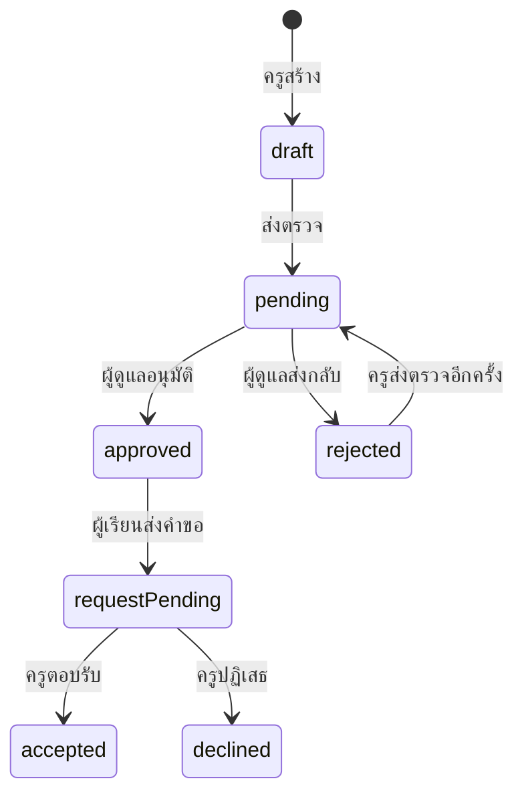

# User journey ที่เชื่อมหน้าเว็บกับ API และข้อมูลถาวร

**สถานะ:** งานทดลองสำหรับระยะถัดไป หลังผู้สร้างกำหนดให้ [Phase 1 เป็น portal](22-phase-1-portal-strategy-and-source-ledger.md)

25 กันยายน 2026 · [เปิดแอป full stack](platform/README.md) · ต่อยอดจาก [use case ตลาดครู](20-teacher-marketplace-use-case-and-incentives.md)

## Persona สมมติและหน้าที่ของระบบ

| Persona | สิ่งที่ต้องการ | จุดเริ่ม | งานปลายทางใน demo | ภาพในแอป |
|---|---|---|---|---|
| มีน, 22, ผู้เริ่มทำเพลง | รู้ว่าชอบทางไหนและเริ่มได้โดยไม่ซื้อเครื่อง | ลองสถานการณ์ หรือค้นครูทันที | ส่ง brief พร้อมเป้าหมาย เวลา งบ และดูคำตอบ | `platform/public/assets/persona-learner.png` |
| ครูต้น, 36, ครูกีตาร์ | ได้ผู้เรียนที่เป้าหมายตรงและลดคำถามซ้ำ | สร้างบริการสอนพร้อมราคา/อุปกรณ์/วิธี feedback | ส่งตรวจและตอบคำขอจากผู้เรียน | `platform/public/assets/persona-teacher.png` |
| แพร, 31, ผู้ดูแลชุมชน | ไม่ให้รายการไม่ครบหรือข้อมูลสมมติแสดงเป็นครูจริง | เห็นคิวรายการ `pending` | อนุมัติหรือแจ้งเหตุผลให้แก้ | `platform/public/assets/persona-admin.png` |

ภาพทั้งหมดสร้างขึ้นใหม่ด้วย imagegen เป็น **persona สมมติ** ไม่ใช้ภาพบุคคลจริงในการอ้างว่าเป็นสมาชิกแพลตฟอร์ม

## จุดที่ปิด gap ระหว่าง frontend และ backend

| สิ่งที่ผู้ใช้เห็น | คำสั่ง/API | สิ่งที่ backend บังคับ | สถานะที่ UI อ่านกลับ |
|---|---|---|---|
| ครูกด “บันทึกร่าง” | `POST /api/listings` | ตรวจข้อมูลและผูก `teacherId` จาก session ไม่รับจากฟอร์ม | `draft` ใน “รายการของฉัน” |
| ครูกด “ส่งตรวจ” | `POST /api/listings/:id/submit` | ตรวจเจ้าของและสถานะที่อนุญาต | `pending` และเข้าคิวผู้ดูแล |
| ผู้ดูแลกดอนุมัติ | `POST /api/admin/listings/:id/review` | ต้องเป็นบทบาทผู้ดูแลและรายการรอตรวจ | `approved`; ปรากฏใน `GET /api/listings` |
| ผู้เรียนเปิดประกาศ | `GET /api/listings` | คืนเฉพาะ approved และกรองจากข้อมูลจริง | ราคา/เงื่อนไขจาก record เดียวกับฝั่งครู |
| ผู้เรียนส่ง brief | `POST /api/requests` | ต้องเป็นรายการ approved; กันคำขอซ้ำ; ไม่รับ teacherId จากหน้าเว็บ | คำขอ `pending` ทั้งในกล่องผู้เรียนและครู |
| ครูตอบ | `POST /api/requests/:id/respond` | ต้องเป็นครูของบริการนั้นและคำขอยัง pending | ผู้เรียนเห็น `accepted/declined` หลังโหลดใหม่ |

## State diagram

## สิ่งที่ยังไม่ถูกอ้างว่าเสร็จ

เดโมนี้พิสูจน์ flow และ data contract บนเครื่องเดียว ยังไม่มีบัญชีจริง/การยืนยันตัวตน การจองชำระเงิน สื่อสารระหว่างคนจริง การตรวจครูจริง การคุ้มครองผู้เยาว์สำหรับการเปิดสาธารณะ หรือการทดสอบ usability กับผู้ใช้ไทยหลายกลุ่ม การเชื่อมขั้นเหล่านี้ควรตัดสินจาก pilot ไม่ใช่เพิ่มขึ้นเพียงเพราะมีหน้าจอพร้อม
