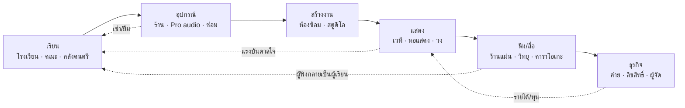

# ออกแบบ Ecosystem วงการดนตรีไทย (เริ่มจากกรุงเทพฯ รายเขต)

26 กันยายน 2026 · ข้อมูลจาก [database/](../../database/README.md) หลังเก็บ **wave 1 (6 เขตแกนกลาง) ครบ** · ใช้คู่กับ [10 persona](../4-users/04-personas-and-use-cases.md) และ [loop ของแอป](../5-product/05-app-loops-journey-ux-spec.md)

**ขอบเขตความถูกต้อง:** ตัวเลขด้านล่างนับเฉพาะสถานที่ที่ผ่าน Gate D (มีแหล่ง https, พิกัดอยู่ในเขตที่ระบุ, ไม่ซ้ำ) ยังไม่ใช่ "ทุกแห่ง" — ร้าน/ห้องซ้อมที่มีแต่เพจ Facebook ที่เปิดไม่ได้ถูกบันทึกเป็นช่องว่าง (gaps) ของแต่ละเขต

## 1. ชั้นของ Ecosystem

ทุกสถานที่ในฐานข้อมูลถูกจัดเข้า 1 ใน 6 ชั้น (ดู `database/lib/classify.cjs`) ชั้นเหล่านี้คือ "ช่วงชีวิต" ของคนทำดนตรี ไม่ใช่หมวดธุรกิจ

| ชั้น | ประเภทในฐานข้อมูล | Persona ที่พึ่งชั้นนี้ | Loop ในแอป |
|---|---|---|---|
| เรียน | school, higher_ed, archive | P1 P2 P3 P4 P9 | L1 ค้นพบ · L2 หาที่ · L3 ฝึก · L9 ผู้ปกครอง |
| อุปกรณ์ | instrument_store, audio_store, repair_luthier | P1 P2 P6 P7 | L4 อุปกรณ์ · L7 ผู้ให้บริการ |
| สร้างงาน | rehearsal, studio | P6 P9 | L5 สร้าง/แสดง |
| แสดง | venue, performing_arts, ensemble | P4 P6 P8 | L5 · L10 ชุมชน |
| ฟัง/สื่อ | record_store, broadcast, karaoke | P1 P9 | L10 |
| ธุรกิจ | business | P8 P9 | L6 อาชีพ |

## 2. ภาพที่ข้อมูลบอก (wave 1 · 136 แห่ง)

| ชั้น | จำนวน | สังเกต |
|---|---|---|
| แสดง | 52 | มากสุด แต่ 23 แห่งเป็น "โรงละคร/ศูนย์ศิลปะ" จาก OSM ที่ต้องทบทวนว่าจัดดนตรีจริงหรือไม่ |
| อุปกรณ์ | 26 | กระจุกในห้างย่านสยาม (ปทุมวัน 12 แห่ง) — คนเขตรอบนอกต้องเดินทางเข้าเมือง |
| เรียน | 25 | โรงเรียนเครือข่ายในห้าง + คณะดนตรีในมหาวิทยาลัย; ครูอิสระยังไม่อยู่ในข้อมูล (อยู่ใน loop L7 ของแอป) |
| ฟัง/สื่อ | 22 | ร้านแผ่นเสียงอิสระเติบโต (10 แห่ง ส่วนใหญ่วัฒนา/ปทุมวัน) |
| สร้างงาน | 6 | **ช่องว่างใหญ่ที่สุด**: ห้องซ้อม 1 แห่ง สตูดิโอ 5 แห่ง — ส่วนใหญ่มีแค่เพจ Facebook จึงหาข้อมูลยืนยันไม่ได้ |
| ธุรกิจ | 3 | ค่ายใหญ่มีสำนักงานในเมือง; ค่ายอิสระ/ผู้จัดยังไม่ถูกเก็บ |

### บุคลิกของแต่ละเขตแกนกลาง

| เขต | รวม | บทบาทเด่นใน ecosystem |
|---|---|---|
| ปทุมวัน | 48 | **ศูนย์กลางการเรียน + อุปกรณ์** (ห้างสยาม/เซ็นทรัลเวิลด์, จุฬาฯ, RBSO) |
| พระนคร | 25 | **มรดกและการแสดง** (ดนตรีไทย, โรงละครแห่งชาติ, เวทีข้าวสาร) |
| วัฒนา | 19 | **เรียน + ฟัง + สร้างงาน** (โรงเรียนใน EmQuartier, ร้านแผ่น, สตูดิโอทองหล่อ, สำนักงานค่าย) |
| บางรัก | 14 | **เวทีกลางคืน** (บาร์แจ๊ส/โรงแรม สีลม–เจริญกรุง) |
| พญาไท / ราชเทวี | 7 / 7 | **ชุมชนนักดนตรี** (ห้องซ้อม ร้านมือสอง วงดุริยางค์ทหาร) |

## 3. การไหลของคุณค่า (ใครได้อะไรจากใคร)

| จาก → ถึง | สิ่งที่ไหล | จุดสะดุดที่แอปแก้ได้ |
|---|---|---|
| ผู้เรียน → โรงเรียน/ครู | ค่าเรียน, เวลา | ไม่รู้ว่าที่ไหนเปิดคาบทดลอง/รับเด็ก → L2 + L9 |
| ผู้เรียน → ร้าน | ซื้อ/เช่า/ซ่อม | ซื้อก่อนมั่นใจ → L4 แนะนำยืม/เช่าก่อน |
| วง → ห้องซ้อม/สตูดิโอ | ค่าชั่วโมง | ไม่รู้ห้องว่าง ข้อมูลอยู่แค่ Facebook → L5 + L7 ให้เจ้าของเคลมหน้า |
| วง → เวที | การแสดง, ผู้ชม | เวทีคัดเดโมไม่ไหว → L5 โปรไฟล์วง + คลิปสด |
| เวที/ผู้ฟัง → ค่าย/ลิขสิทธิ์ | ค่าลิขสิทธิ์, สัญญา | นักดนตรีใหม่ไม่เห็นเส้นทาง → L6 แผนที่อาชีพ |
| ทุกฝ่าย → ข้อมูลกลาง | รายงาน/แก้ไข | ข้อมูลเก่า → L8 ป้ายความสด + คิวผู้ดูแล |

## 4. ผู้เล่นระดับประเทศที่ต้องเพิ่มเป็นชั้น "สนับสนุน" (ยังไม่อยู่ในฐานข้อมูล)

ไม่ใช่สถานที่เรียนหรือซื้อของ แต่กำหนดกติกาและทุนของ ecosystem ต้องเก็บเป็นตาราง `organizations` แยกจาก `places` พร้อมแหล่งทางการก่อนแสดงในแอป:

- หน่วยงานรัฐด้านวัฒนธรรม/ความคิดสร้างสรรค์ และโครงการเรียนรู้ของกรุงเทพมหานคร (มีหน้าคอร์สดนตรีไทยใน [ทะเบียนเดิม](../3-sources/04-institutions-and-bangkok-map.md))
- องค์กรจัดเก็บค่าลิขสิทธิ์เพลง
- แพลตฟอร์มสตรีมมิ่งและระบบขายบัตร
- เทศกาลดนตรีและผู้จัดคอนเสิร์ต
- สถาบันอุดมศึกษา 25 แห่งที่มีอยู่แล้วในตาราง `universities` (เชื่อมกับ `places` ชนิด higher_ed ภายหลัง)

## 5. แผนเก็บข้อมูลรายเขตต่อจากนี้

| Wave | เขต | สถานะ | หมายเหตุ |
|---|---|---|---|
| 1 | ปทุมวัน ราชเทวี พระนคร บางรัก วัฒนา พญาไท | ✅ ค้นเว็บครบ ผ่าน Gate D | 13+ ช่องว่างต่อเขตบันทึกในไฟล์ |
| 2 | 20 เขตวงใน (สาทร คลองเตย ห้วยขวาง ดินแดง จตุจักร ดุสิต ป้อมปราบฯ สัมพันธวงศ์ ...) | กำลังเก็บ (4+4 เขตแรก) | เพิ่มห้าง Ratchada/Rama 9, ตลาดนัดจตุจักร, ย่านเครื่องดนตรีเก่าวรจักร |
| 3 | 24 เขตวงนอก | OSM ก่อน แล้วค้นเว็บ | เน้นโรงเรียนในห้างชานเมืองและห้องซ้อม |

**สิ่งที่ต้องทำเพื่อเข้าใกล้คำว่า "ทุกแห่ง":** (1) ให้เจ้าของเคลมและเติมหน้าเอง (L7) โดยเฉพาะห้องซ้อม/สตูดิโอ; (2) ผู้ใช้รายงานที่ขาด (L8 เพิ่ม "เสนอสถานที่ใหม่"); (3) ตรวจภาคสนามรายเขตตาม `audit/bangkok-district-audit.csv` — ข้อมูลออนไลน์อย่างเดียวไม่พอสำหรับธุรกิจที่มีแต่ Facebook
