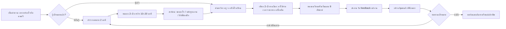

# ข้อเสนอ User Journey และหน้าตาแอปหลังระดมความคิด 10 รอบ

ปรับปรุง 25 กันยายน 2026 | **Product hypothesis** ที่ต้องทดสอบ ไม่ใช่แอปที่สร้างเสร็จหรือผลสัมภาษณ์ผู้ใช้ | หลักฐาน [15](../4-users/02-app-research.md) · กระบวนการ 10 รอบ [16](../4-users/03-ten-brainstorm-rounds.md)

## แนวคิดหลัก

**ชื่อใช้อธิบายชั่วคราว:** Music Industry Lap — “ลองทำงานดนตรีก่อนเลือกทางเรียน”

**งานที่แอปช่วยผู้เริ่มต้น:** จาก `ไม่รู้ว่าสายดนตรีมีอะไร` ไปสู่ `ทำงานจำลองสั้น ๆ → รู้ว่าชอบอะไร/ต้องฝึกอะไร → พบครู สถานที่ และคนร่วมทางที่เข้าถึงได้ → เรียนต่อจริง`. สำหรับคนที่รู้เป้าหมายแล้ว เปิดค้นหาครู/ที่เรียนได้ทันที. ทุกคนใช้แกนสำรวจและทดลองได้ฟรีในช่วงแรกตามเจตนาผู้สร้าง

**สมมติฐานความต่าง:** บริการไทยอย่าง [SAMT](https://www.mysamt.com/) มีการค้นหาครูและกิจกรรมแล้ว; แกนที่จะทดลองคือการช่วยคน **ยังไม่รู้จะเรียนอะไร** ด้วย role simulation และการแสดงต้นทุน/ข้อจำกัดจริงก่อนจับคู่ ไม่อ้างว่าแอปนี้เป็นแห่งแรกหรือดีกว่าโดยไม่มีการทดสอบ

## เส้นทางหลักของผู้เรียน



## หน้าตาแอปในมือถือ (low-fidelity)

### 1. หน้าแรก: ลดความกลัวเลือกผิด

```text
┌──────────────────────────────┐
│ Music Industry Lap            │
│ ดนตรีมีมากกว่าหนึ่งทาง        │
│                              │
│ วันนี้อยากลองทำอะไร?          │
│ [ ยังไม่รู้ — ลองสำรวจ  ]    │
│ [ รู้แล้ว — หาครู/ที่เรียน ]    │
│                              │
│ ทดลองฟรี • ใช้มือถือก็เริ่มได้ │
│ บทบาทวันนี้: นักร้อง / คนทำเพลง│
│ ผู้จัดเวที / ครู / ช่างเสียง   │
└──────────────────────────────┘
```

ไม่บังคับสร้างบัญชีก่อนลองภารกิจแรก; ขอสมัครเมื่อจะบันทึกผลงาน/ติดต่อคนอื่น. มีปุ่มเปลี่ยนภาษา/ขนาดตัวอักษรและคำบรรยาย. ข้อความ “ใช้ฟรี” ต้องระบุให้ตรงว่าบริการใดของครู/ร้านภายนอกมีค่าใช้จ่าย

### 2. สำรวจสาย: งานจริงก่อนชื่อคณะ

การ์ดแต่ละสายมี `เขาทำอะไร`, `งานหนึ่งวัน`, `ทักษะที่ใช้`, `ลองภารกิจ`, `เรียนต่อที่ไหนได้`, `ใครให้ feedback`, `ค่าใช้จ่ายเริ่มต้นที่พบ (พร้อมแหล่ง/วันที่)`. การ์ดแบ่งบทบาทเป็น **เล่นและร้อง / สร้างและผลิต / สอน / เทคโนโลยีและงานสด / ธุรกิจและชุมชน / ดนตรีไทยและมรดก**; ผู้เรียนค้นชื่อเครื่องดนตรีหรืออาชีพได้ ไม่ต้องเดาหมวด

### 3. ภารกิจทดลอง: ทำให้เสร็จครั้งแรก

การ์ดภารกิจแสดง `เวลา 15 นาที`, `อุปกรณ์: มือถือหรือกระดาษ`, `ต้องฟังเสียง/มีทางเลือกข้อความไหม`, `ชิ้นงานที่จะได้`, `ยังไม่ต้องมีเครื่องดนตรี`. ตัวอย่างสามงานแรก:

| ภารกิจ | งานที่ทำ | หลักฐาน | สิ่งที่รู้หลังจบ |
|---|---|---|---|
| ผู้เล่น/นักร้อง | ฟังท่อน 8 ห้อง แล้วร้อง/เคาะ/เล่นตอบ 2 รอบ | เสียงหรือสาธิตต่อครู | ชอบการแสดง การฝึกซ้ำ และ feedback แบบไหน |
| โปรดิวเซอร์ | เรียงเสียงที่สร้างเองเป็น intro 20 วินาทีด้วยมือถือหรือบัตรกระดาษ | demo/sequence | ชอบจัดชั้นเสียง แก้ปัญหา และเล่าอารมณ์ไหม |
| ผู้จัดเวที | จัดลำดับ 3 วงกับเวลาและงบจำกัด; เจอสมาชิกมาสาย | run sheet หนึ่งหน้า | ชอบประสานงานและตัดสินใจหน้างานไหม |

หลังส่งงาน ไม่ขึ้นป้าย “คุณเหมาะกับอาชีพ X” แต่ถาม `ช่วงไหนสนุก`, `ช่วงไหนยาก`, `อยากลองอะไรอีก`, และแสดงทักษะที่ฝึกได้จริง. การให้คะแนนแบบคัดคนออกจากคลิปแรกเสี่ยงตีความฐานะ/พื้นฐานเป็นความสามารถ

### 4. ผลการสำรวจ: แผนที่ทางเลือก ไม่ใช่คำทำนาย

```text
┌──────────────────────────────┐
│ งานที่คุณลองแล้ว 3/3          │
│ สนุกที่สุด: จัดเสียงและเล่าเรื่อง│
│ งานที่อยากลองต่อ: ทำเพลง /     │
│ ช่างเสียงสด                   │
│ ทักษะร่วมที่เห็น: ฟัง-ปรับงาน  │
│ สิ่งที่ฝึกต่อ: จังหวะ, บันทึกเสียง│
│ [ ลองอีกสาย ] [ ดูทางเรียน ]  │
│ คุณเปลี่ยนเส้นทางได้ทุกเมื่อ   │
└──────────────────────────────┘
```

### 5. หาครู/ที่เรียน: ข้อมูลตัดสินใจครบ

ตัวกรองขั้นต่ำ: เป้าหมาย, วิชา/บทบาท, ระดับ, จังหวัด/ระยะทาง, ออนไลน์/ออนไซต์, วันเวลา, ราคา **ต่อคาบและรวมค่าสมัคร/หนังสือ/เดินทางโดยประมาณ**, มีเครื่องให้ลอง/ยืม, ภาษาที่สอน, รองรับความต้องการเข้าถึง. เปิดรายชื่อครบและเปรียบเทียบ 2–3 รายได้; ลำดับแรกต้องอธิบายเหตุผล `ตรงเป้าหมาย/เวลา/งบ/พื้นที่` และไม่เป็นการซื้ออันดับเงียบ ๆ

โปรไฟล์แสดง `ข้อมูลที่ผู้สอนระบุ` และ `ข้อมูลที่ทีมตรวจแล้ว` แยกชัด, ผลงานสอนระดับนั้น, วิธี feedback, นโยบายทดลองเรียน/ยกเลิก, วันที่ปรับปรุง, ช่องทางรายงานข้อมูลผิด. แหล่งผู้ให้บริการมีได้ทั้งครูอิสระ โรงเรียนดนตรี ชมรม วง สถาบันมหาวิทยาลัย และจุดยืมเครื่อง; ไม่บังคับให้ผลลัพธ์เป็นคาบเสียเงิน

### 6. แผน 8 สัปดาห์และชุมชน

หลังเลือกทาง ระบบช่วยตั้งเป้าเล็ก เช่น `เล่นท่อนหนึ่งให้ตรงจังหวะ` หรือ `ทำ demo 30 วินาที`. แสดง `งานสัปดาห์นี้`, `ส่งงาน`, `feedback`, `ฉบับแก้`, `นัดครั้งถัดไป`, `ทางเลือกถ้าติดงบ/เวลา`. ชุมชนเริ่มเป็น cohort/วงที่มีผู้ดูแลและกติกาชัด; งาน/กิจกรรมต้องมีผู้จัด วันที่ ค่าใช้จ่าย และเงื่อนไขจริง. ผู้เรียนเลือกไม่เผยแพร่ผลงานสาธารณะได้

## งานของฝั่งอื่นในระบบนิเวศ

| ผู้ใช้ | สมัคร/เพิ่มอะไร | คุณค่าที่ได้รับ | ภาระ/ความเสี่ยงที่ต้องจัดการ |
|---|---|---|---|
| ครู | วิชา ระดับ พื้นที่ ตาราง ราคา วิธี feedback หลักฐาน | พบผู้เรียนที่มีเป้าหมายตรงและเห็นชิ้นงานก่อนคุย | อัปเดตข้อมูลและเวลาตอบ; อย่าสัญญา feedback ฟรีไม่จำกัด |
| โรงเรียน/สถาบัน | หลักสูตร รอบรับสมัคร ราคา ค่าเพิ่ม กิจกรรม เครื่องยืม | คนเห็นเส้นทางเรียนที่ตรงเป้า | ข้อมูลคอร์สเก่า/ที่นั่งเต็ม |
| วง/ผู้จัดงาน | ระดับที่รับสมัคร เวลา สถานที่ งบ เงื่อนไข | พบสมาชิก/ผู้เข้าร่วมที่พร้อม | ความปลอดภัย การคัดเลือกที่เป็นธรรม |
| ร้าน/ช่าง/จุดยืม | เครื่องที่ให้ลอง/ยืม ราคา เงื่อนไขซ่อม | พบผู้เริ่มต้นที่ต้องการอุปกรณ์เหมาะสม | ราคาสด สภาพเครื่อง เงินประกัน |
| ศิลปิน/มืออาชีพ | บทบาท พอร์ต ขอบเขตการเป็น mentor/รับงาน | ช่องทางสอน/เป็นตัวอย่างสายงาน | สิทธิในผลงานและค่าตอบแทน |

## ขอบเขต MVP ที่สร้างและทดสอบได้

**เนื้อหา**: 6 บทบาทแรก ครอบคลุมผู้เล่น/นักร้อง ผู้แต่งเพลง โปรดิวเซอร์ ครู ผู้จัดงาน และงานร้าน/ช่าง; ทำภารกิจจริง 3 บทบาทก่อน. **พื้นที่**: นำร่องหนึ่งพื้นที่เมืองและหนึ่งพื้นที่นอกเมืองที่มีพันธมิตรตรวจข้อมูลได้ ไม่อ้างครอบคลุมประเทศไทย. **ผู้ให้บริการ**: ครู/สถานที่จำนวนเล็กที่ตรวจมือ. **ผลิตภัณฑ์**: mobile web ที่เปิดได้โดยไม่ติดตั้งก่อน; ใช้เนื้อหาขนาดเล็ก/พิมพ์ได้; บันทึกงานอย่างง่าย. ยังไม่สร้าง DAW, ระบบจ่ายเงิน, ฟีดสาธารณะ หรือคะแนนความถนัดจาก AI

## ทดสอบก่อนลงทุนสร้างเต็ม

| การทดสอบ | วิธี | คำถามตัดสินใจ |
|---|---|---|
| สัมภาษณ์ 15–20 คนต่างวัย/พื้นที่/งบ + ครู 5–10 คน | ดูวิธีค้นหาและเลือกเรียนในปัจจุบัน; ให้เล่าเหตุการณ์จริง | pain point นี้เกิดถี่และรุนแรงพอหรือไม่ |
| Prototype สองทางเข้า | คนกลุ่มหนึ่งค้นครูทันที อีกกลุ่มลองภารกิจก่อน; ให้เลือกเองด้วย | การทดลองช่วยหรือขวางการตัดสินใจ |
| Concierge 4 สัปดาห์ | ทีมจับคู่ครู/ที่เรียนด้วยมือและตามผล | ข้อมูลใดจำเป็นต่อการจับคู่และต้องตรวจบ่อยแค่ไหน |
| Access audit | ให้คนไม่มีเครื่อง คนใช้เน็ตจำกัด และผู้ใช้เทคโนโลยีช่วยเข้าถึงลองจริง | ใครถูกกันออก และแก้จุดไหนก่อน |
| Teacher workload | ให้ครูตอบงานจริง 1 รอบ จับเวลาตั้งแต่เปิดงานถึง feedback | feedback ฟรีในขอบเขตใดที่ทำต่อเนื่องได้ |

**ตัวชี้วัด**: `เริ่มภารกิจ / เห็นการ์ด`, `จบภารกิจ / เริ่ม`, `ส่งงาน / จบ`, `ได้ feedback ภายในเวลาที่ตกลง / ส่งงาน`, `เลือกทางต่อและอธิบายได้ / จบ 2 ภารกิจ`, `เริ่มเรียน/ร่วมวงจริง / ขอจับคู่`, `ยังฝึกหลัง 8 สัปดาห์ / เริ่มเรียน`. แยกตามการมีเครื่องดนตรี งบ เวลา/ระยะทาง และอุปกรณ์เท่าที่ผู้ใช้สมัครใจให้ข้อมูล; รายงานจำนวนตัวอย่าง. อย่าประกาศว่าปิด gap แล้วเพียงเพราะยอดติดตั้งเพิ่ม

## ความเสี่ยงที่ต้องตัดสินใจก่อนเปิดให้คนทั่วไปใช้

1. **ข้อมูลผู้เยาว์/ความปลอดภัย**: โปรไฟล์ส่วนตัวเป็นค่าเริ่มต้น การติดต่อและเผยแพร่เสียง/ภาพอยู่ภายใต้ผู้ดูแลที่เหมาะสมและการยินยอม
2. **ความถูกต้องของข้อมูล**: แสดงวันตรวจราคา หลักสูตร และกิจกรรม; ปิดรายการที่ติดต่อไม่ได้; ให้รายงานข้อมูลผิด
3. **สิทธิในเสียงและเพลง**: ภารกิจใช้เสียงที่สร้างเองหรือได้รับอนุญาต พร้อมเครดิต/เงื่อนไขเผยแพร่
4. **การเข้าถึง**: ใช้แนว [CAST UDL](https://www.cast.org/what-we-do/universal-design-for-learning/) และ [WCAG 2.2](https://www.w3.org/TR/wcag/) แล้วทดสอบกับผู้ใช้จริง; ไม่ให้ภารกิจใช้ดาต้าหรืออุปกรณ์สูงเป็นประตูเดียว
5. **ความสามารถของทีมช่วงใช้ฟรี**: จำกัดพื้นที่และจำนวนครูที่ดูแลได้ก่อนขยาย; วัดคุณภาพการจับคู่และ feedback ควบคู่กับจำนวนผู้ใช้

## ข้อสรุปหลัง 10 รอบ

แอปควรมีรูปร่างเป็น **“เข็มทิศ + สนามทดลอง + ทางเชื่อมคนจริง”**. จุดเริ่มคือให้ผู้เรียนลงมือในบทบาทดนตรีที่หลากหลายโดยใช้ทรัพยากรต่ำ ผลทดลองกลายเป็นข้อมูลส่วนตัวสำหรับเลือกการเรียนที่เหมาะ และการเรียนต่อเชื่อมกับครู วง โรงเรียน ร้าน และโอกาสในพื้นที่. จุดตัดสินใจสำคัญของ MVP คือพิสูจน์ว่า **Try ก่อน Match** ช่วยคนที่ยังไม่รู้ทางได้จริง โดยไม่ทำให้คนที่รู้เป้าหมายแล้วช้าลง
