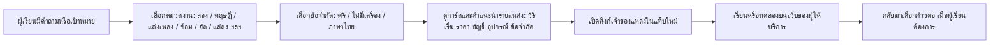

# Phase 1: Music Industry Lap เป็น portal นำทางไปยังแหล่งเรียนที่มีอยู่

ปรับตามทิศทางผู้สร้างโครงการ 25 กันยายน 2026 · [เปิดต้นแบบ portal](../../portal/index.html) · [ทะเบียนแหล่งฉบับขยาย 35 รายการ](../3-sources/02-resource-directory.md) · เนื้อหาและสถานะบริการภายนอกต้องตรวจซ้ำก่อนเผยแพร่สาธารณะ

## ขอบเขตที่ใช้จริงในขั้นแรก

ผู้เรียนเลือกเป้าหมายและข้อจำกัด แล้ว portal แสดงลิงก์ออกไปยัง **เว็บไซต์/แอป/ครู/หลักสูตรของผู้ให้บริการเดิม** พร้อมเหตุผลที่แนะนำ เงื่อนไขค่าใช้จ่าย ภาษา อุปกรณ์ บัญชี และวันตรวจล่าสุด ไม่มีการทำบทเรียน ระบบจอง ตลาดครู รับเงิน หรือบัญชีผู้เรียนของเราเองใน Phase 1. หน้า portal เป็นหน้าคัดและอธิบายทางเลือก ไม่คัดลอกหรือโฮสต์เนื้อหาของเจ้าของแหล่งเรียน

`app-demo/` และ `platform/` เป็น **ต้นแบบสำรวจสำหรับระยะถัดไป** โดยเฉพาะระบบครูลงงาน/คำขอเรียน ไม่ใช่สิ่งที่ต้องเปิดตัวใน Phase 1. ภาพ persona ที่สร้างไว้ใช้เพื่ออธิบายผู้เรียนในหน้า portal และมีป้ายว่าเป็นคนสมมติ

## Journey ระยะเริ่มต้น

**ตัวอย่างเส้นทาง:** คนยังไม่มีเครื่องและไม่อยากจ่ายเริ่มจาก Chrome Music Lab หรือ Ableton Learning Music; คนอยากทำเดโมไป BandLab หลังเห็นว่าต้องมีบัญชี; คนอยากหาครูไทยไป SAMT แล้วตรวจราคา/เงื่อนไขกับครู; คนสนใจปริญญาไปประกาศล่าสุดของมหิดลโดยตรง

## ทะเบียนชุดแรกและฉบับขยาย

ตารางด้านล่างเป็น **11 แหล่งตั้งต้น**; ขณะนี้ portal มี **35 แหล่ง** พร้อมแอปเมโทรนอม ตั้งเสียง ซ้อม แต่งเพลง เขียนโน้ต อัดเพลง และจัดการแสดง ดู [ทะเบียนฉบับขยาย](../3-sources/02-resource-directory.md) และเปิดคำแนะนำรายแหล่งใน [portal](../../portal/index.html)

| แหล่ง/ลิงก์เจ้าของ | จุดที่ใช้ใน portal | ค่าใช้จ่าย/เงื่อนไขที่ตรวจได้ | ตรวจ 25 ก.ย. 2569 |
|---|---|---|---|
| [Chrome Music Lab](https://musiclab.chromeexperiments.com/) | ลองเสียงและ Song Maker | ไม่ต้องมีบัญชี; เปิดใน browser หลายอุปกรณ์ | หน้าเว็บเจ้าของ |
| [Ableton Learning Music](https://learningmusic.ableton.com/) | เรียนการทำ beat และทำนองเบื้องต้น | หน้าเว็บระบุว่าไม่ต้องมีประสบการณ์หรือเครื่องมือก่อน | หน้าเว็บเจ้าของ |
| [musictheory.net Lessons](https://www.musictheory.net/lessons) | อ่านโน้ต จังหวะ สเกล | บทเรียนเว็บฟรี | หน้าเว็บเจ้าของ |
| [musictheory.net Exercises](https://www.musictheory.net/exercises) | ฝึกโน้ต fretboard และการฟัง | แบบฝึกเว็บฟรี | หน้าเว็บเจ้าของ |
| [BandLab Studio คู่มือเริ่มต้น](https://help.bandlab.com/hc/en-us/articles/115002945153-Getting-Started-with-the-BandLab-Studio) → [Studio](https://www.bandlab.com/) | อัด/ตัดต่อเดโมบนเว็บหรือมือถือ | Studio ฟรี; ต้องสมัครเพื่อสร้างโปรเจกต์ | ศูนย์ช่วยเหลือเจ้าของ |
| [MuseScore Studio](https://musescore.org/en) | เขียนและเรียบเรียงโน้ต | โปรแกรม desktop ฟรี; แยกจากบริการ sheet music ที่อาจมีเงื่อนไขอื่น | เว็บไซต์โปรแกรม |
| [Guitareo on Musora](https://www.musora.com/guitar) และ [เงื่อนไขทดลอง](https://www.musora.com/choose-trial) | ฝึกกีตาร์ตามลำดับ | ทดลองใช้ฟรี 7 วันโดยต้องใช้อีเมลและบัตร จากนั้นมีค่าสมาชิก; ราคาอาจเปลี่ยน | หน้าเจ้าของ |
| [SAMT Music](https://www.mysamt.com/) | หาครูในไทยตามวิชา/พื้นที่ | ค้นหาครูได้; ค่าเรียนและเงื่อนไขขึ้นกับผู้ให้บริการ | หน้าเจ้าของ |
| [CHULA MOOC: ดนตรีบำบัด](https://mooc.chula.ac.th/course-detail/76) | สำรวจสายงานดนตรีบำบัด | MOOC เปิดเรียนฟรี แต่ต้องตรวจรอบและขั้นสมัครของรายวิชา | หน้ารายวิชา/หน้า CHULA MOOC |
| [Thai MOOC: ศิลปกรรมท้องถิ่นชายแดนใต้](https://thaimooc.ac.th/courses/course-v1psu005200/) | สำรวจดนตรีและวัฒนธรรมท้องถิ่น | ตรวจสถานะเปิดเรียนและบัญชีก่อนเข้าร่วม | หน้ารายวิชา |
| [Mahidol Music Admissions](https://www.music.mahidol.ac.th/admissions/) | ตรวจเส้นทางเรียนต่อ | ข้อกำหนด รอบ และค่าใช้จ่ายเปลี่ยนตามปี; อ่านคู่มือปีปัจจุบัน | หน้าสถาบัน |

**ข้อสังเกต:** ลิงก์ใน portal เป็นทางออกไปยังแหล่งที่เป็นเจ้าของเนื้อหา ไม่ใช่พาร์ตเนอร์หรือการรับรองคุณภาพรายบุคคลของ Music Industry Lap. ราคา/สิทธิ์/รอบเรียนเปลี่ยนได้เสมอ ควรแสดงวันที่ตรวจและให้ผู้เรียนอ่านหน้าปลายทางก่อนสมัครหรือจ่ายเงิน

## กติกาคัดแหล่งและการดูแลหลังเปิด

1. ทุกการ์ดมี URL ปลายทางและ URL หลักฐานจากเจ้าของแหล่ง; เปิดแท็บใหม่พร้อม `noopener noreferrer`
2. ไม่อ้างว่า “ฟรี” ถ้ามีเพียงทดลองใช้ฟรี; ระบุบัตร/สมาชิกเมื่อแหล่งประกาศไว้
3. บอกภาษา อุปกรณ์ และความจำเป็นต้องสมัครบัญชี เพื่อไม่ให้ผู้เรียนไปติดประตูตอนปลายทาง
4. ตรวจลิงก์ที่อาจเปลี่ยนบ่อย เช่น ราคา/รอบรับสมัคร/สถานะคอร์ส ก่อนเผยแพร่ และทำรอบตรวจซ้ำอย่างน้อยรายเดือนในช่วง pilot
5. เมื่อ link เสียหรือเนื้อหาเปลี่ยน นำการ์ดออก/แก้สถานะ และเสนอแหล่งอื่นที่บรรลุเป้าหมายใกล้กัน; ไม่ส่งผู้เรียนไปหน้า 404
6. ไม่ scrape, copy หรือฝังบทเรียน/ภาพโลโก้จากเว็บอื่นใน portal โดยพลการ; ใช้ข้อความสรุปของเราเองและลิงก์ตรง
7. ถ้ามี affiliate/ความร่วมมือในอนาคต ให้เปิดเผยชัด และแยกจากเหตุผลด้านความเหมาะสมของผู้เรียน

## จะวัดว่า portal ช่วยจริงหรือไม่

เริ่มด้วยการทดสอบกับผู้เรียนหลายระดับและครู: ให้หาทางเริ่มจากโจทย์จริง แล้วสังเกตว่าเลือกแหล่งถูก เข้าใจค่าใช้จ่ายก่อนออกไป และกลับมาอธิบายก้าวถัดไปได้หรือไม่ ตัวชี้วัดหลักคือ `ผู้เรียนที่พบทางเริ่มใน 3 นาที`, `เข้าใจเงื่อนไขก่อนคลิก`, `ลิงก์ที่ยังใช้งานได้`, และ `สัดส่วนที่บอกว่าแหล่งตรงเป้าหมายหลังลอง`. หากเก็บคลิกในภายหลัง ให้แจ้งการเก็บข้อมูลและใช้ข้อมูลให้น้อยที่สุด

## เงื่อนไขก่อนขยายเป็น marketplace

ทำก็ต่อเมื่อพบหลักฐานว่า portal ยังแก้ไม่ได้ เช่น ผู้เรียนหาครูเฉพาะทางในไทยไม่ได้ ข้อมูลครูไม่ครบ หรือการแนะนำจากหลายเว็บยังทำให้คนตัดสินใจยาก จากนั้นค่อยทดสอบ `platform/` กับครูและผู้เรียนจริงในวงเล็กพร้อมระบบยืนยันตัวตนและการดูแลข้อมูลที่เหมาะสม
